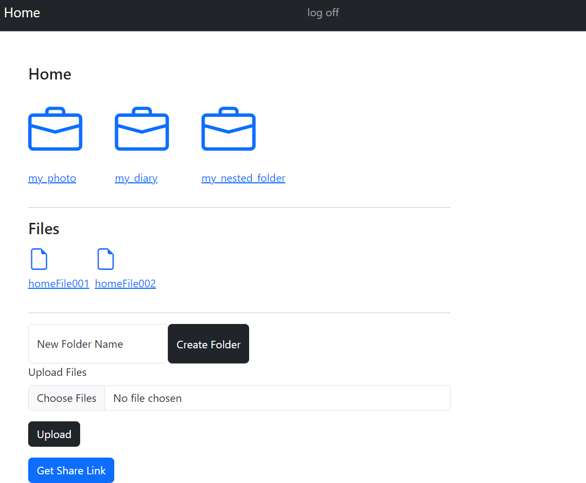

# Cloudy-drive / odin-file-uploader
A simple web app with Node Express, Prisma and PostgreSQL.

A stripped down version of Google Drive. :)

This is part of the projects of The Odin Project course

## Live demo

- https://odin-file-uploader.adaptable.app/

## Tech-stack
- FE : bootstrap
- BE : ejs, node.js, express, postgreSQL, prisma, supabase

## Installation
1. create your supabase account and project, get the SUPABASE_PROJECT_URL and SUPABASE_API_KEY.
1. create .env file, fill in like the .env-sample.
2. npm run serverstart

## Source

- https://github.com/WongYC-66/odin-file-uploader
